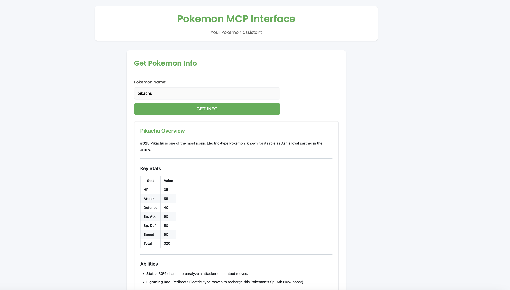

# Pokemon MCP Server

A modular Pokemon information and strategy server that provides:
- Pokemon information retrieval
- Pokemon comparison
- Type matchup analysis
- Team composition suggestions

# Pokemon MCP Interface

A modern web interface for interacting with Pokemon data using MCP.

## Features

- **Information Retrieval**: Get detailed Pokemon data including stats, types, abilities, and moves
- **Comparison**: Compare multiple Pokemon side by side
- **Strategy**: Analyze type matchup analysis and get counter-strategy recommendations
- **Team Building**: Get team suggestions based on roles and type coverage

## Setup and Configuration

### Prerequisites

1. Install uv if not already installed:
```bash
curl -LsSf https://astral.sh/uv/install.sh | sh
```

2. Make sure you're in the pokemon directory:
```bash
cd /path/to/pokemon
```

### Claude Desktop Configuration
1. Open Claude Desktop settings
2. Add a new MCP configuration:
```json
{
    "pokemon": {
        "command": "uv",
        "args": [
            "--directory",
            "/path/to/pokemon",
            "run",
            "pokemon_mcp.py"
        ]
    }
}
```
Replace `/path/to/pokemon` with your actual path to the pokemon directory.

## Usage

### Set up environment variables:
   ```bash
   GROQ_API_KEY=your_api_key_here
   ```

### Running the Server at 8000
```bash
uv run pokemon_mcp.py
```

### Running the Frontend Interface at 8080
```bash
uv run web_interface.py
```


### Example Queries

- Get Pokemon info: `get info pikachu`
- Compare Pokemon: `compare pikachu charizard`
- Get type matchups: `strategy mewtwo`
- Get team suggestions: `team balanced offensive`
